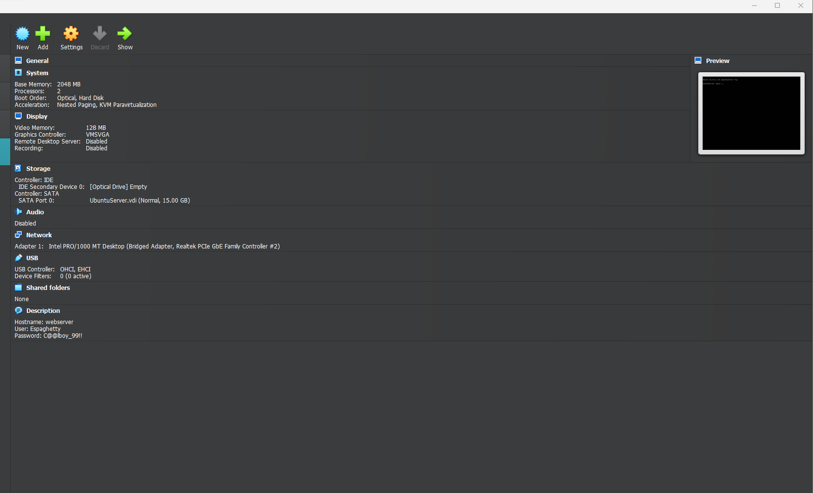

# Deliverable 2 Questions Answered!
##### Created by: Bryant Polanco

## What are the server hardware specifications (virtual machine settings)? Take a screenshot - don’t type it!

## What is Ubuntu server log in screen? Take screenshot - do not type it!

## What is the IP address of your Ubuntu Server Virtual Machine?
What is your Ubuntu-server Ip address:
**Ip Address:** 192.168.4.72

## How do you enable the Ubuntu Firewall?
**Enable** apache ubuntu ***firewall:***
```
sudo ufw enable
```
## How do you disable the Ubuntu Firewall?
**Disable** apache ubuntu ***firewall:***
```
sudo ufw disable
```
## How do you check if the Ubuntu Firewall is running?
Checking the status of the apache ubuntu ***firewall:***
```
sudo ufw status
```
## How do you add Apache to the Firewall?
**Adding** apache ubuntu to the ***firewall:***
```
sudo ufw allow 'Apache'
```
## What is the command you used to install Apache?
**Install** apache ***Ubuntu-Server***
```
sudo apt install apache2 -y
```
## What is the command you use to check if Apache is running?
**Checking** the status of the apache ***ubuntu-server***
```
systemctl status apache2
```
## What is the command you use to stop Apache?
***Stopping*** apache 
```
sudo systemctl stop apache2
```
## What is the command you use to restart Apache?
***Restarting*** apache 
```
sudo systemctl restart apache2
```
## What is the command used to test Apache configuration?
***Test*** the configuration for errors:
```
sudo apache2ctl configtest
```
## What is the command used to check the installed version of Apache?
***Check*** what version of Apache you have installed:
```
apachectl -v
```