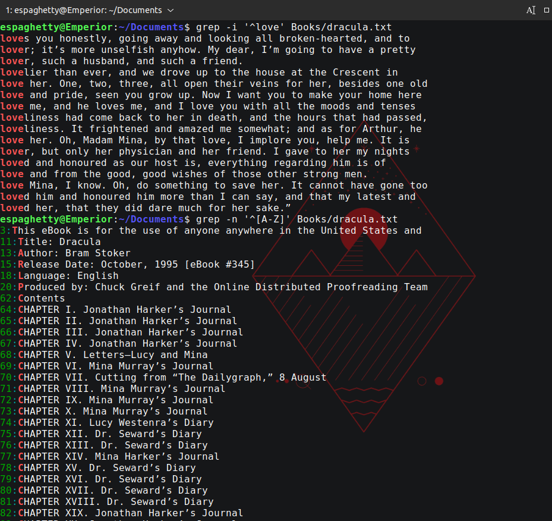

# Lab 7 - Handling files Submission

## Question 1 cat, tac, head, tail
1. Display the content of the ```/etc/passwd``` file.
    
2. Display the content of the ```/etc/passwd``` file in reverse order.
    
3. Display the content of the ```/etc/passwd``` file with line numbers and the $ to   indicate the end of every line.
    
4. Display the first 5 lines of a the ```/etc/passwd``` file.
    

## Question 2 cut
1. Display the first field of the ```/etc/passwd``` file.
    
2. Display the first and last field of the ```/etc/passwd``` file
    
3. Display the first and last field of the ```/etc/passwd``` file with the ```=``` as the output delimiter.
    
4. Display all the fields of the ```/etc/passwd``` file except the 3rd field.
    

## Question 3
1. Download these files using curl. Use the command: ```curl -s URL-here -o name-of-file``` where the name of the file is the one given in the URL. After Downloading the files, paste the files
~~htps://cis106.com/assets/shopping.txt~~
~~htps://cis106.com/assets/tasks.txt~~
2. How many lines does the book dracula book have?
3. How many words does the book “Pride and Prejudice” have?
Sort the file ```/etc/passwd```


## Question 4 tr, grep
1. Replace the ```;``` for a ```,``` in the ```cereal.csv``` file
    
2. Display every line that contain the word love in the book *“Pride and 
Prejudice”*
    
3. Display every line that contains exactly the word love or hate in the book *“Pride and Prejudice”* with line numbers 
4. Display every line that starts exactly with the word **“love”** in the book Dracula. Display every line that starts with an upper case letter or a number in the book Dracula.
    
   


## Question 5 awk and sed
1. Print the first and last field of the ```cars.csv``` file
    
2. Print the first and last field of the ```cars.csv``` file with the string ```" made in "```as a delimiter
    
3. Print the ```cars.csv``` file in such a way that the output looks like this for every line:
```
The Chevy S-10 has 4 cylinders and is made in US
```

4. Print the ```cars.csv``` file excluding the first 2 records (lines).
    
5. Print all the car names in upper case.
    
6. Replace all the instances of the word ```Dracula``` for the word ```Alucard``` in the book dracula.
    
7. Insert a blank line after each line in the ```/etc/passwd``` file
    
8. Replace all the repeated blank lines for a single blank line in the book “Pride and Prejudice” 
    

## Question 6 I/O Redirection
1. How many users can login with the  ```/bin/bash``` shell?

2. How many users have the ```/sbin/nologin``` shell assigned?

3. How many ford vehicles are there in the ```cars.csv``` file


4. How many 4 letter words are there in the bible?


## !!!!Challenge Question!!!!
1. Display only the names of the cereals in the ```cereal.csv``` file. (Tip: use cut, awk and the pipe)

2. Sort the output of the previous command and save it to a file called ```cereal-sorted.csv```. *(Beware that the first 2 lines need to be removed)*

3. Display the names of the cereals and the amount of calories they have per serving.

4. Repeat the previous command but replace the ```;``` with a ```,```


&copy; Bryant F. Polanco *CIS106*-**2023**