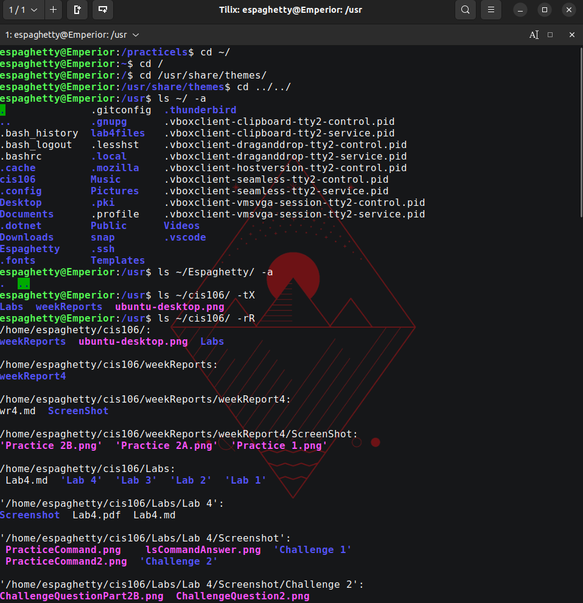
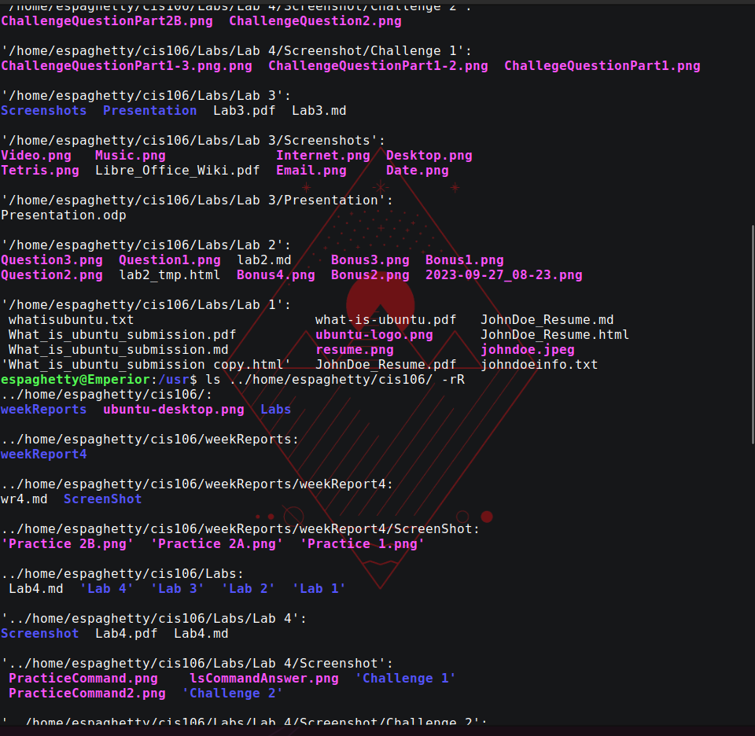
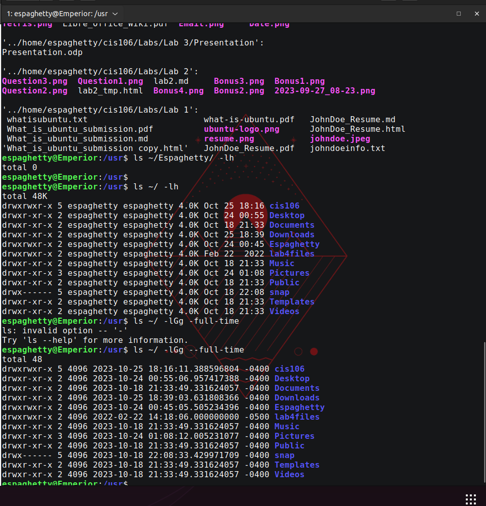

# The Linux File System Solution

## Section 1

## Section 2

## Challenge Question 

# Week report part 2 
| Command | What it does                            | Syntax                   | Example           |
| ------- | --------------------------------------- | ------------------------ | ----------------- |
| ls      | list directory contents                 | `ls` + `option` + `file` | `ls -l Documents` |
| cd      | Change directory                        | `cd` + `directory name`  | `cd /home/`       |
| pwd     | print name of current/working directory | `pwd` + `option`         | `pwd -l`          |

## Basic Terminology
* File System - Where your data is held and organized by your liking. 
* Current directory - The directory you are currently in; changes can be made to the directory
* Parent directory - Parent directory is the main files name. (i.e home is the parent file to our user file) 
* Your home - Our home is referring to your user's home directory.
* The home - refers to the home directory
* pathname - The folders / direction taken to end up at the selected file
* relative path - Does not start with /. Relative file starts with a subdirectory (the file before the wanted directory)
* absolute path - Starts with a /. The entire path of the wanted file is used /displayed. 
  
 ### Bryant F. Polanco
