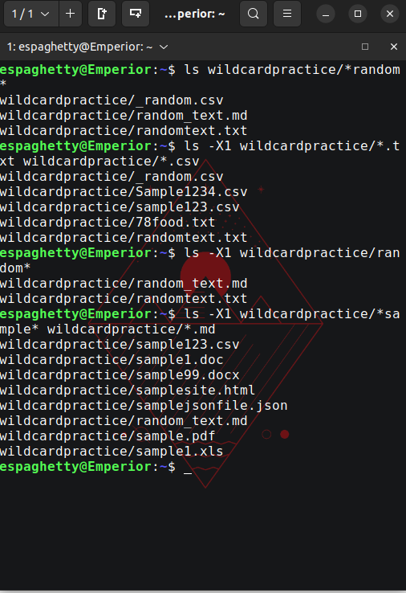
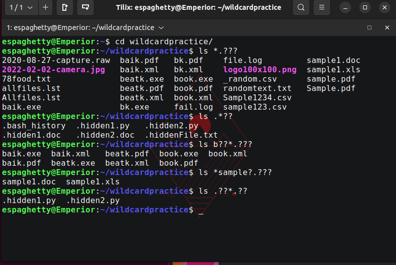
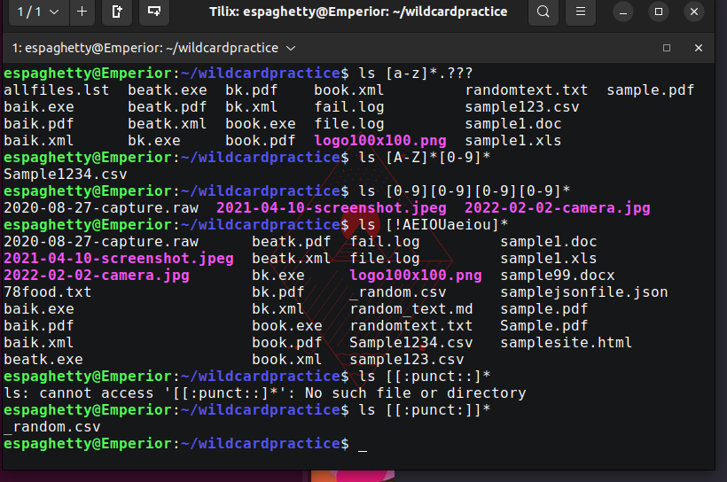
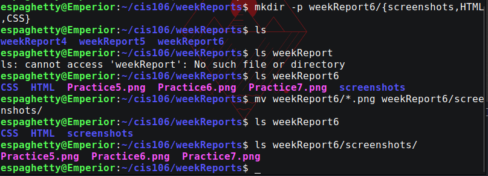

# Week Report 6 Finished

### Practice 5

### Practice 6

### Practice 7


----

## Brace expansion

### Brace example 1

 
#### Create a directory tree with brace expansion
```
mkdir -p games/{mustFinish,quededGames}/{Boring,Amusing}
```
#### Creating files
```
touch games/mustFinish/Amusing/{RedDeadRedemption,FinalFantasy16}.txt; touch games/mustFinish/Boring/{MetalGearRising,HaloInfinte}.txt
```

#### Removing the same directory
```
rm -r games/{mustFinish,quededGames}/{Boring,Amusing}
```

# Bryant Polanco